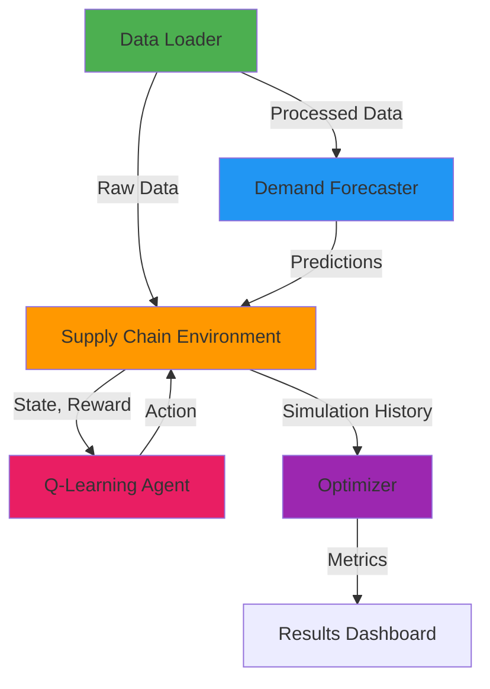
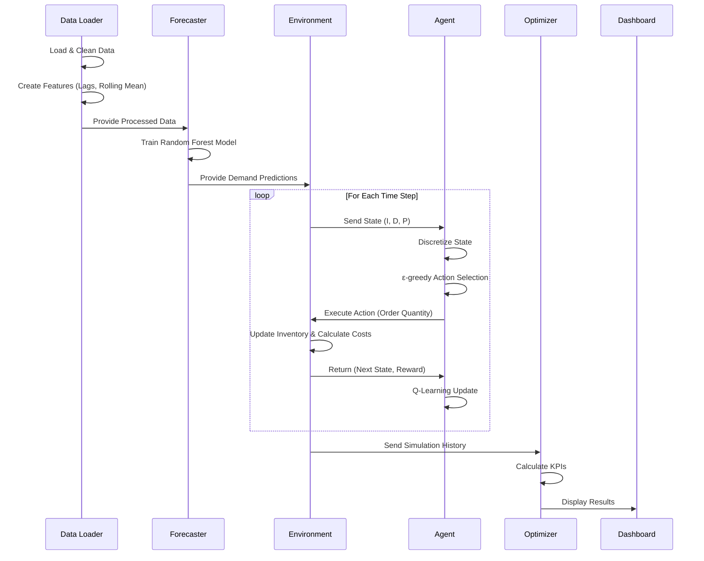

# Supply Chain Optimization System - Mathematical Algorithms Explanation

## 📋 Overview

This document provides a comprehensive explanation of all modules in your Self-Learning AI Agent System for dynamic supply chain optimization, with detailed mathematical formulations and algorithms.

---

## 🗂️ Module Architecture

---

## 1️⃣ Data Loader Module (`data_loader.py`)

### **Purpose**
Prepares historical supply chain data for forecasting and simulation by cleaning, feature engineering, and transformation.

### **Mathematical Algorithms**

#### A. **Forward Fill Interpolation**
For handling missing values:

$$
x_i = \begin{cases}
x_i & \text{if } x_i \text{ is not missing} \\
x_{i-1} & \text{if } x_i \text{ is missing}
\end{cases}
$$

Where:
- $x_i$ = value at position $i$
- $x_{i-1}$ = last known value before position $i$

#### B. **Lag Features**
Creates temporal dependencies:

$$
\text{Demand\_Lag}_t = \text{Demand}_{t-1}
$$

Where:
- $t$ = current time step
- Captures previous demand to predict current demand

#### C. **Rolling Mean (Moving Average)**
Smooths demand fluctuations:

$$
\text{Rolling\_Mean}_t = \frac{1}{w} \sum_{i=t-w+1}^{t} \text{Demand}_i
$$

Where:
- $w$ = window size (3 in your implementation)
- Reduces noise in demand patterns

#### D. **Temporal Feature Extraction**
Extracts cyclical patterns from dates:

$$
\begin{aligned}
\text{Day} &= \text{day\_of\_month}(t) \\
\text{Month} &= \text{month}(t) \in [1, 12] \\
\text{DayOfWeek} &= \text{weekday}(t) \in [0, 6]
\end{aligned}
$$

These capture seasonal and weekly patterns.

---

## 2️⃣ Demand Forecaster Module (`forecaster.py`)

### **Purpose**
Predicts future demand using machine learning to enable proactive inventory planning.

### **Algorithm: Random Forest Regression**

#### A. **Model Architecture**
Ensemble of 100 decision trees:

$$
\hat{y} = \frac{1}{N} \sum_{i=1}^{N} T_i(\mathbf{x})
$$

Where:
- $\hat{y}$ = predicted demand
- $N = 100$ = number of trees
- $T_i(\mathbf{x})$ = prediction from tree $i$
- $\mathbf{x}$ = feature vector $[\text{Demand\_Lag}_1, \text{Rolling\_Mean}_3, \text{Day}, \text{Month}, \text{DayOfWeek}]$

#### B. **Decision Tree Split Criterion**
Each tree uses Mean Squared Error (MSE) for splitting:

$$
\text{MSE} = \frac{1}{n} \sum_{i=1}^{n} (y_i - \bar{y})^2
$$

The best split minimizes:

$$
\text{Information Gain} = \text{MSE}_{\text{parent}} - \left( \frac{n_{\text{left}}}{n} \text{MSE}_{\text{left}} + \frac{n_{\text{right}}}{n} \text{MSE}_{\text{right}} \right)
$$

#### C. **Bootstrap Aggregating (Bagging)**
Each tree is trained on a random sample with replacement:

$$
\mathcal{D}_i = \text{Bootstrap}(\mathcal{D}, n)
$$

Where $\mathcal{D}_i$ is the training set for tree $i$

#### D. **Evaluation Metric: RMSE**

$$
\text{RMSE} = \sqrt{\frac{1}{n} \sum_{i=1}^{n} (y_i - \hat{y}_i)^2}
$$

Where:
- $y_i$ = actual demand
- $\hat{y}_i$ = predicted demand
- Lower RMSE indicates better forecasting accuracy

---

## 3️⃣ Q-Learning Agent Module (`agent.py`)

### **Purpose**
Learns optimal inventory ordering policies through reinforcement learning.

### **Algorithm: Q-Learning (Temporal Difference Learning)**

#### A. **State Space Discretization**

**Continuous State:**
$$
s = (\text{inventory}, \text{demand}, \text{pending\_orders})
$$

**Discretized State:**
$$
s' = (I_{\text{bin}}, D_{\text{bin}}, P)
$$

Where:

- **Inventory Binning:**
$$
I_{\text{bin}} = \begin{cases}
\text{negative} & \text{if } I < 0 \\
\text{low} & \text{if } 0 \leq I < 20 \\
\text{medium} & \text{if } 20 \leq I < 100 \\
\text{high} & \text{if } I \geq 100
\end{cases}
$$

- **Demand Binning:**
$$
D_{\text{bin}} = \begin{cases}
\text{low} & \text{if } D < 50 \\
\text{medium} & \text{if } 50 \leq D < 100 \\
\text{high} & \text{if } D \geq 100
\end{cases}
$$

#### B. **Action Space**
$$
\mathcal{A} = \{0, 50, 100\}
$$

Represents order quantities (units to order)

#### C. **Q-Learning Update Rule**

$$
Q(s, a) \leftarrow Q(s, a) + \alpha \left[ r + \gamma \max_{a'} Q(s', a') - Q(s, a) \right]
$$

Where:
- $Q(s, a)$ = quality of taking action $a$ in state $s$
- $\alpha = 0.1$ = learning rate (how fast to update beliefs)
- $\gamma = 0.95$ = discount factor (importance of future rewards)
- $r$ = immediate reward
- $s'$ = next state
- $a'$ = next action

**Components:**
- **TD Target:** $r + \gamma \max_{a'} Q(s', a')$
- **TD Error:** $\delta = \text{TD Target} - Q(s, a)$
- **Update:** $Q(s, a) \leftarrow Q(s, a) + \alpha \cdot \delta$

#### D. **ε-Greedy Exploration Strategy**

$$
a = \begin{cases}
\text{random action} & \text{with probability } \epsilon = 0.1 \\
\arg\max_{a} Q(s, a) & \text{with probability } 1 - \epsilon
\end{cases}
$$

This balances:
- **Exploration:** Try new actions (10%)
- **Exploitation:** Use best known action (90%)

#### E. **Bellman Optimality Equation**

The Q-Learning algorithm converges to the optimal policy $\pi^*$:

$$
Q^*(s, a) = \mathbb{E}\left[ r + \gamma \max_{a'} Q^*(s', a') \mid s, a \right]
$$

The optimal policy is:
$$
\pi^*(s) = \arg\max_{a} Q^*(s, a)
$$

---

## 4️⃣ Supply Chain Environment Module (`environment.py`)

### **Purpose**
Simulates the supply chain dynamics including inventory management, order fulfillment, and cost calculations.

### **Mathematical Model**

#### A. **Inventory Dynamics**

$$
I_{t+1} = I_t + A_t - S_t
$$

Where:
- $I_t$ = inventory at time $t$
- $A_t$ = arrivals at time $t$ (from previous orders)
- $S_t$ = sales at time $t$

#### B. **Order Lead Time**

Orders placed at time $t$ arrive at time $t + L$ where $L = 5$ days:

$$
A_{t+L} = a_t
$$

Where $a_t$ is the order quantity placed at time $t$

#### C. **Sales Calculation**

$$
S_t = \min(I_t, D_t)
$$

Where:
- $D_t$ = demand at time $t$
- Sales cannot exceed available inventory

#### D. **Lost Sales (Stockouts)**

$$
L_t = \max(0, D_t - I_t) = D_t - S_t
$$

Represents unfulfilled demand

#### E. **Cost Function**

**Total Cost:**
$$
C_t = C_{\text{order}}(a_t) + C_{\text{holding}}(I_t) + C_{\text{stockout}}(L_t)
$$

**Component Costs:**

1. **Ordering Cost:**
$$
C_{\text{order}}(a) = \begin{cases}
50 + 10a & \text{if } a > 0 \\
0 & \text{if } a = 0
\end{cases}
$$
- Fixed cost: $50 per order
- Variable cost: $10 per unit

2. **Holding Cost:**
$$
C_{\text{holding}}(I) = 2 \cdot I
$$
- $2 per unit per day in inventory

3. **Stockout Cost:**
$$
C_{\text{stockout}}(L) = 10 \cdot L
$$
- $10 per unit of lost sales

#### F. **Revenue Function**

$$
R_t = 20 \cdot S_t
$$

Where $20 is the selling price per unit

#### G. **Reward Function (Profit)**

$$
r_t = R_t - C_t = 20 \cdot S_t - \left[ C_{\text{order}}(a_t) + 2 \cdot I_t + 10 \cdot L_t \right]
$$

**Objective:** Maximize cumulative reward:
$$
\max \sum_{t=0}^{T} r_t
$$

---

## 5️⃣ Optimizer Module (`optimizer.py`)

### **Purpose**
Calculates key performance indicators (KPIs) to evaluate supply chain efficiency.

### **Performance Metrics**

#### A. **Service Level**

$$
\text{Service Level} = \frac{\sum_{t=1}^{T} S_t}{\sum_{t=1}^{T} D_t} = \frac{\text{Total Sold}}{\text{Total Demand}}
$$

Where:
- Range: $[0, 1]$ or $[0\%, 100\%]$
- Ideal: Close to 1 (fulfilling all demand)
- Measures customer satisfaction

#### B. **Total Lost Sales**

$$
\text{Total Lost Sales} = \sum_{t=1}^{T} L_t = \sum_{t=1}^{T} \max(0, D_t - I_t)
$$

Lower is better (fewer stockouts)

#### C. **Average Inventory Level**

$$
\text{Avg Inventory} = \frac{1}{T} \sum_{t=1}^{T} I_t
$$

Where:
- Too high: Excessive holding costs
- Too low: Risk of stockouts
- Optimal: Balanced level

#### D. **Inventory Turnover** (Derived Metric)

$$
\text{Inventory Turnover} = \frac{\text{Total Sold}}{\text{Avg Inventory}}
$$

Higher is generally better (efficient inventory usage)

---

## 🔄 System Integration Flow

### **Complete Algorithm Workflow**

### **Mathematical Optimization Objective**

The system aims to find the optimal policy $\pi^*$ that maximizes expected cumulative profit:

$$
\pi^* = \arg\max_{\pi} \mathbb{E}\left[ \sum_{t=0}^{T} \gamma^t r_t \mid \pi \right]
$$

Subject to:
- Inventory constraints: $I_t \geq 0$ (no negative inventory)
- Action constraints: $a_t \in \{0, 50, 100\}$
- Lead time: $L = 5$ days

---

## 📊 Key Mathematical Concepts Summary

| **Module** | **Primary Algorithm** | **Mathematical Foundation** |
|------------|----------------------|----------------------------|
| Data Loader | Feature Engineering | Time Series Analysis, Moving Averages |
| Forecaster | Random Forest | Ensemble Learning, Bootstrap Aggregating |
| Agent | Q-Learning | Markov Decision Process, Bellman Equation |
| Environment | Inventory Simulation | Difference Equations, Cost Modeling |
| Optimizer | KPI Calculation | Statistical Aggregation, Performance Metrics |

---

## 🎯 System Goals

1. **Minimize Costs:**
   $$
   \min \sum_{t=1}^{T} \left( C_{\text{holding}} + C_{\text{stockout}} + C_{\text{order}} \right)
   $$

2. **Maximize Service Level:**
   $$
   \max \frac{\sum S_t}{\sum D_t}
   $$

3. **Optimize Inventory:**
   $$
   I^* = \arg\min_{I} \left( C_{\text{holding}}(I) + C_{\text{stockout}}(I) \right)
   $$

---

## 🔬 Advanced Concepts Used

### **1. Markov Decision Process (MDP)**
Your RL agent operates in an MDP defined by:
- **States** ($\mathcal{S}$): Inventory levels, demand, pending orders
- **Actions** ($\mathcal{A}$): Order quantities
- **Transition** ($P$): State dynamics from environment
- **Reward** ($R$): Profit function
- **Policy** ($\pi$): Mapping from states to actions

### **2. Temporal Difference (TD) Learning**
Q-Learning is a TD method that learns online:

$$
V(s) \leftarrow V(s) + \alpha [r + \gamma V(s') - V(s)]
$$

Bridges Monte Carlo (requires complete episodes) and Dynamic Programming (requires model)

### **3. Economic Order Quantity (EOQ) - Related Concept**
While not explicitly implemented, your system approximates:

$$
Q^* = \sqrt{\frac{2DS}{H}}
$$

Where:
- $D$ = annual demand
- $S$ = ordering cost
- $H$ = holding cost per unit

The RL agent learns this implicitly through rewards!

---

## 📈 Performance Optimization

### **Trade-off Analysis**

The system balances:

$$
\min \left[ \alpha \cdot C_{\text{holding}} + \beta \cdot C_{\text{stockout}} + \gamma \cdot C_{\text{order}} \right]
$$

Where $\alpha, \beta, \gamma$ are implicit weights learned through the reward function.

### **Exploration vs Exploitation**

$$
\text{Expected Reward} = (1-\epsilon) \cdot Q^*(s,a) + \epsilon \cdot \mathbb{E}[Q(s, a_{\text{random}})]
$$

Balancing immediate gain (exploitation) vs information gain (exploration)

---

## 🚀 Future Enhancement Opportunities

1. **Deep Q-Networks (DQN):** Replace Q-table with neural networks for continuous states
2. **Multi-product Optimization:** Extend to multiple SKUs
3. **Stochastic Demand:** Model demand uncertainty with probability distributions
4. **Dynamic Pricing:** Incorporate price elasticity

---

## 📚 References

- **Q-Learning:** Watkins, C. J., & Dayan, P. (1992). Q-learning. Machine learning, 8(3-4), 279-292.
- **Random Forest:** Breiman, L. (2001). Random forests. Machine learning, 45(1), 5-32.
- **Inventory Theory:** Silver, E. A., Pyke, D. F., & Peterson, R. (1998). Inventory management and production planning and scheduling.

---

**Document Generated:** 2026-02-02
**Project:** Self-Learning AI Agent for Supply Chain Optimization
